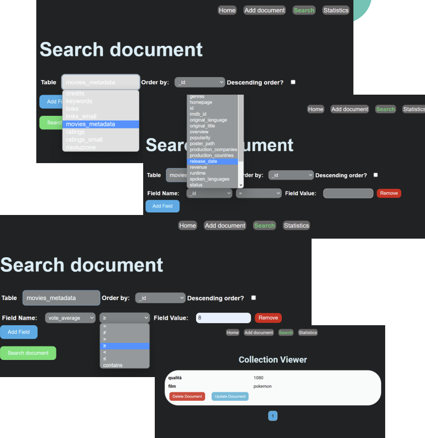

# Progetto Basi di Dati 2 - Gestione Dataset Film

## Descrizione
Questo progetto è stato realizzato come parte del corso di Basi di Dati 2 con il Prof. Genoeff Tortora. L'obiettivo principale è stato acquisire un dataset di film da Kaggle e implementare un'applicazione web per eseguire operazioni di CRUD (Create, Read, Update, Delete) su di esso. Inoltre, sono state sviluppate funzionalità per generare statistiche utili per coloro che devono selezionare i film da pubblicare, come ad esempio i tre film più visitati in ogni regione.

## Operazioni CRUD
L'applicazione web consente di eseguire le seguenti operazioni CRUD sul dataset di film:
- **Create**: Aggiungere nuovi film al dataset con informazioni dettagliate.
- **Read**: Visualizzare i dettagli dei film presenti nel dataset.
- **Update**: Modificare le informazioni dei film esistenti.
- **Delete**: Rimuovere film dal dataset.

## Visualizzazione dei Film con Oltre 5 Stelle o Determinati Attributi
L'applicazione offre la possibilità di visualizzare i film che soddisfano determinati criteri, tra cui:
- **Film con oltre 5 stelle**: Mostra i film che hanno ricevuto una valutazione media superiore a 5 stelle.
- **Film con attributi specifici**: È possibile filtrare i film in base a determinati attributi, come genere, anno di uscita, attori principali, ecc.

Questa funzionalità consente agli utenti di identificare facilmente i film di alta qualità o quelli che corrispondono alle loro preferenze specifiche.

## Statistiche
Le statistiche generate dall'applicazione includono:
- I tre film più visitati in ogni regione, utili per comprendere le preferenze del pubblico in diverse aree geografiche.

## Tecnologie Utilizzate
- Linguaggio di Programmazione: [Inserire il linguaggio di programmazione utilizzato, ad esempio Python]
- Framework Web: [Inserire il framework web utilizzato, ad esempio Flask]
- Database: [Inserire il database utilizzato, ad esempio SQLite]

## Istruzioni per l'Installazione e l'Esecuzione
1. Clonare questo repository sul tuo sistema locale.
2. Assicurarsi di avere installato tutte le dipendenze necessarie specificate nel file `requirements.txt`.
3. Eseguire l'applicazione web eseguendo il file principale, ad esempio `app.py`.
4. Accedere all'applicazione tramite il browser web utilizzando l'URL specificato nelle istruzioni dell'applicazione.

## Crediti
Questo progetto è stato realizzato da [Inserire il tuo nome] come parte del corso di Basi di Dati 2 presso [Inserire il nome dell'istituzione] con la guida del Prof. Genoeff Tortora.

